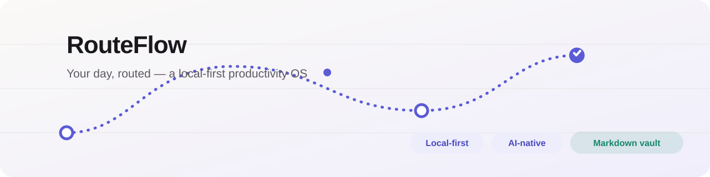

<div align="center">



**Your day, routed.** A local-first personal productivity OS — tasks, habits, goals,
a weekly planner, focus timer and live analytics in one calm app. Your data lives as
plain Markdown you (and your AI agent) can read and edit.

[](https://github.com/Parsa-Nasiri/RouteFlow/actions/workflows/ci.yml)
[](LICENSE)
[](package.json)
[](tsconfig.json)
[](https://react.dev)
[](https://vitejs.dev)
[](CONTRIBUTING.md)

[Getting started](#-getting-started) · [AI-native](#-ai-native-by-design) · [The vault](#-your-data-as-markdown) · [Architecture](#-architecture) · [Docs](#-documentation)

</div>

---

## Why RouteFlow?

Most productivity apps are SaaS silos: your data lives in someone else's database,
exported only through CSV. RouteFlow is the opposite — a **local-first operating
system for your day** where:

- ⚡ **Everything is instant and offline** — no accounts, no servers to call home, no tracking. One `npm install && npm run dev`.
- 📝 **Your data is plain Markdown** — the app's entire state lives in a `vault/` of readable, editable `.md` files. Open them in any editor, grep them, back them up with git.
- 🤖 **AI-native, not AI-bolted-on** — AI agents (Hermes, ZCode, Claude Code, anything that can read/write files) control the app *natively* by editing the vault. Changes appear live in the open app within ~2 seconds.
- 🧠 **It thinks about you, not the other way around** — a Today score computed from what you actually did, habit streaks that forgive "not yet today", analytics that find your peak hours.
- 🎨 **It feels like a product** — hand-crafted design system, light/dark/system themes, keyboard-friendly, reduced-motion aware, zero console noise.

## ✨ What's inside

| Area | Highlights |
| --- | --- |
| **Onboarding** | 5-step skippable flow (name, goal, working hours, energy, habits) that personalizes everything; repeatable from Settings |
| **Today** | Weighted score ring (tasks · habits · focus · schedule), today's tasks with due times, habit check-offs, goal progress, live schedule timeline with "now" marker, quick-start focus |
| **Tasks** | List + kanban board, drag-and-drop, filters (priority/category/status/due), search, detail modal, goal linking |
| **Habits** | Icon/color/weekday customization, current & best streaks, weekly grid, completion %, 28-day heatmap detail view |
| **Goals** | Milestone-driven auto progress, active/paused/completed, milestone route timeline, linked tasks |
| **Planner** | Monday-based week grid; create blocks by clicking, drag across days, resize edges (15-min snapping); visual distinction between blocks (filled) and due-dated tasks (outline pills) |
| **Focus** | Pomodoro timer (25/45/60 + breaks), task/goal linking, logged sessions, finish-early-and-log, zen mode, tab-title countdown |
| **Analytics** | 7/30-day task & focus trends, habit heatmaps, goal bars, most productive weekday & time band — all computed live |
| **Settings** | Light/dark/system theme, profile & working hours, focus target, JSON export, validated import, reset, onboarding restart |

## 🚀 Getting started

**Requirements:** [Node.js](https://nodejs.org) 18+ (20/22 recommended) and npm.

```bash
git clone https://github.com/Parsa-Nasiri/RouteFlow.git
cd RouteFlow
npm install
npm run dev
```

Open the printed URL (default `http://localhost:5173`). You'll get a short,
skippable onboarding — then an empty, uncluttered app that fills up with *your* life.

| Command | What it does |
| --- | --- |
| `npm run dev` | Dev server + the Markdown vault + agent API |
| `npm test` | 87 tests: domain logic, full-app render flows, vault round-trips & disk sync |
| `npm run build` | Type-check + production bundle (`dist/`) |
| `npm run preview` | Serve the production build (vault + agent API included) |

> **Note:** the app starts **empty by design** — no demo tasks, goals or habits.
> Every entity you see was deliberately created by you or your agent.

## 🤖 AI-native by design

While the dev server runs, an AI agent can drive RouteFlow the same way you do —
not by scraping the UI, but by editing its Markdown files. Flip a checkbox, and the
open browser tab updates within ~2 seconds with a toast summarizing the change.

```markdown
## Today
- [ ] Call the dentist `id:task_a | priority:low | category:Personal | due:2026-08-17 | time:09:00`
## Done
- [x] Ship the demo `id:task_b | priority:high | category:Work`
```

The repo ships with everything an agent needs:

- **`.agents/skills/routeflow/SKILL.md`** — the operating manual: vault formats, editing rules, id stability, sync etiquette.
- **`references/triage.md`** — the judgment layer: how to decide whether user input is a *task, habit, goal, block or session* (tasks are the workhorse; goals are rare north stars; when torn, prefer the lighter container).
- **`references/api.md`** — an optional local HTTP API (`/api/state`, `/api/actions`) wrapping the app's real reducer, for atomic programmatic edits.
- **`references/recipes.md`** — compound workflows: daily kickoff, weekly planning, weekly review.
- **`KNOWLEDGE_BASE.md`** — everything an AI (or human) needs to understand the project.

Copy the skill globally so any agent on your machine can use it:

```bash
cp -r .agents/skills/routeflow ~/.agents/skills/
```

## 📝 Your data, as Markdown

```
vault/
  tasks.md        checkbox lists under ## Today / ## In Progress / ## Backlog / ## Done
  habits.md       one ## section per habit + dated check-in lines
  goals/*.md      one file per goal: description + ## Milestones checkboxes
  planner.md      ## YYYY-MM-DD days with time blocks
  focus-log.md    one line per completed focus session
  profile.md      name, goal, working hours, energy, theme
```

The vault is the single source of truth while the server runs (the browser mirrors
to localStorage and syncs both ways). The parser is tolerant — unknown lines are
ignored, missing ids are generated and written back, section headings drive status.
Delete a line to delete an entity. The format is fully documented in
[`vault/README.md`](vault/README.md) once generated, and in the skill above.
`vault/` is gitignored by default — it's your personal data.

## 🏗 Architecture

React 18 + TypeScript (strict) + Vite 5 + Tailwind CSS 3, react-router 6, custom
dependency-free charts, one reducer for everything.

```
src/
  types.ts            all entity types
  lib/                pure domain logic: dates, streaks, scoring, analytics, seed, storage
  store/core.ts       the reducer + action vocabulary (shared by UI, API and tests)
  store/StoreContext  React provider: localStorage mirror + vault/API sync
  components/         ui/ design system · charts/ · tasks/ · layout/
  pages/              Onboarding · Today · Tasks · Planner · Focus · Habits · Goals · Analytics · Settings
plugins/
  vault.ts            state ⇄ Markdown (tolerant parser, serializer, disk-rescan store)
  routeflow-api.ts    Vite plugin: vault-backed /api endpoints (localhost writes only)
vault/                your data (gitignored)
.agents/skills/       the agent skill + references
```

Key principle: **one reducer, three clients.** The browser UI, the agent HTTP API
and the vault parser all funnel into the same `reducer()` — so an AI edit, a UI
click and a test assertion all produce identical, validated state. Scores, streaks
and analytics are always derived, never stored.

## 📚 Documentation

| Doc | What's in it |
| --- | --- |
| [README](README.md) | You are here |
| [KNOWLEDGE_BASE.md](KNOWLEDGE_BASE.md) | Project deep-dive: architecture, data model, score formula, sync design, FAQ |
| [.agents/skills/routeflow/SKILL.md](.agents/skills/routeflow/SKILL.md) | Agent operating manual (vault-first) |
| [references/triage.md](.agents/skills/routeflow/references/triage.md) | How agents decide where user input belongs |
| [references/api.md](.agents/skills/routeflow/references/api.md) | Optional HTTP API contract |
| [references/recipes.md](.agents/skills/routeflow/references/recipes.md) | Agent workflows (kickoff, planning, review) |
| [CONTRIBUTING.md](CONTRIBUTING.md) | Setup, code style, commit & PR conventions |
| [CHANGELOG.md](CHANGELOG.md) | Release history |

## 🧪 Testing

```bash
npm test
```

87 tests across three layers: pure domain logic (streak math, score weights, seed
determinism, migrations), full-app jsdom flows (render the real `App` and walk
onboarding → tasks → planner → focus → analytics → settings), and vault/API tests
(lossless Markdown round-trips, agent-style edits, live disk-rescan adoption,
reducer parity between UI and API).

## 🗺 Roadmap

- [ ] Browser extension to open the vault in one click
- [ ] End-to-end encryption for optional vault sync between machines
- [ ] Natural-language quick-add in the UI
- [ ] ICS import for external calendars
- [ ] Plugin API for custom analytics widgets

## ❓ FAQ

**Where does my data live?** In `vault/*.md` while the dev/preview server runs, mirrored to your browser's localStorage. No cloud, ever.

**Can I use it without an AI agent?** Absolutely — the agent layer is invisible until you invite it in.

**Will AI edits break my data?** The parser is deliberately forgiving and validates enums/dates; unknown content is ignored, ids are preserved, and destructive API actions require explicit types. Your vault is also just files — put it under your own git if you want history.

**Is there a hosted version?** No, and that's the point. `npm run dev` is the product.

**Why React + Vite + Tailwind?** Fast DX, strict types, zero-runtime styling — and everything stays local-first with no backend dependency.

## 🤝 Contributing

Issues and pull requests are welcome — see [CONTRIBUTING.md](CONTRIBUTING.md).
Please never commit your `vault/` directory; bug reports with reproducible steps
(and test cases when possible) get fixed fastest.

## 📄 License

[MIT](LICENSE) © 2026 Parsa Nasiri

<div align="center">

**RouteFlow** — plan like a human, automate like an agent.

⭐ Star it if it routes your day better.

</div>
